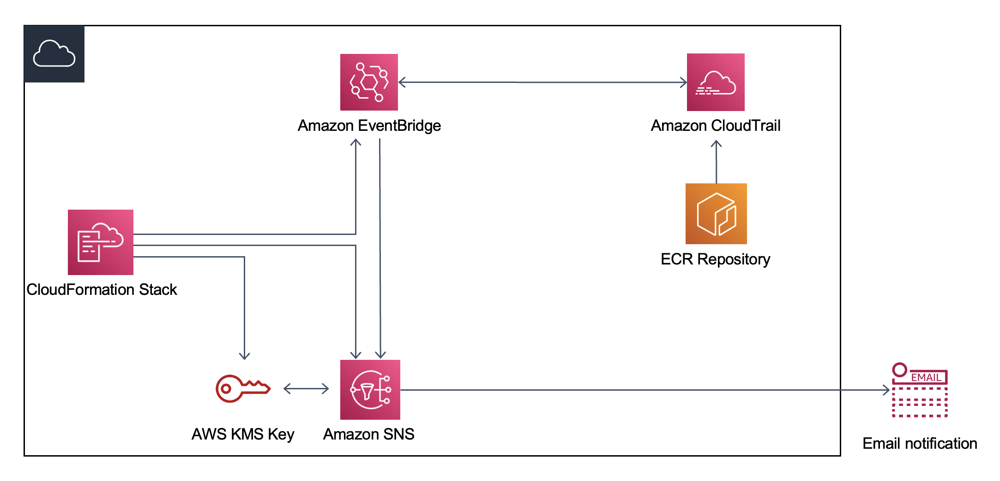

# Amazon Eventbridge Notification for ECR API Calls

In this GitHub repository, you will get a step by step guidance to deploy an Amazon CloudFormation (CFN) template to automatically create all the resources and settings required to `enable SNS Notification for EventBridge Rule API Calls` for `Elastic Container Registry (ECR) Service`. 

## Table of Contents

  - [Architecture Diagram](#architecture-diagram)
  - [Input Parameters](#input-parameters)
  - [How to get-started?](#how-to-get-started)
  - [Resources in the template](#resources-in-the-template)
  - [Clean Up](#clean-up)
  - [License](#license)

## Architecture Diagram:


## Input Parameters:

Explore more about the parameters being asked in the Template:

 - Solution Configuration
   * `Solution Objective:` Select either SUCESS or FAILURE. For each a Custom Event Pattern is defined in the template.

 - EventBridge Configuration
   * `EventBridge Rule Name:` A rule can't have same name as another rule in the same Region and on the same event bus.
   * `CTrail Event Name/API Call:` This is to be mentioned as per any API Call for ECR Service, which you can explore at: [ECR API Operations](https://docs.aws.amazon.com/AmazonECR/latest/APIReference/API_Operations.html).
   
> Please note, All Events from API actions that start with the keywords List, Get, or Describe aren't processed by EventBridge. You can explore more about this at: [Events from AWS services](https://docs.aws.amazon.com/eventbridge/latest/userguide/eb-service-event.html).

 - SNS Configuration
   * `SNS Topic Name:` Enter any Topic Name such as _APISNSTopic_.
   * `SNS Protocol:` Based on your requirement, you can select SNS Protocol which will be used under **Subscription** creation.
   * `SNS Endpoint (as per SNS Protocol):` Enter the endpoint as per the selected SNS Protocol (for eg: an email id for "email" protocol).

## How to get-started?
To get-started, kindly follow the following steps:
1. Open the AWS CloudFormation console at https://console.aws.amazon.com/cloudformation. And select **create stack > With new resources (Standard)** option.
2. Upload the template by selecting **Upload a template file**.
3. Specify the `Stack Name` and requested fields for `Solution Configuration, EventBridge & SNS Configuration` (Explore details about these in below sections). 
4. Post-configuring, go to next-page and leave all fields default.
5. In the next-page, click **Submit**.
6. Within few minutes, an EventBridge Rule & SNS Topic will be created and you will receive a subscription notification (as per the protocol selected in **Step 3**).

## Resources in the Template:

### 1. EventBridge Rule:
*CloudFormation Resource Type : AWS::Events::Rule*

The purpose of an **EventBridge rule** is to match incoming events and send them to targets for processing. In this solution, we are creating a rule for type `AWS API Call via CloudTrail`. The created rule will identify Events - "API Call triggered by eventSource: `ecr.amazonaws.com`" and send them to the Target - **SNS Topic**.

In the template, we are using sample Custom Event Pattern like below for Successful & Failure API Call (this can be changed as per Input Parameter "CTrail Event Name/API Call"):
- **Successful API Call:**
```
{
  "detail-type": ["AWS API Call via CloudTrail"],
  "source": ["aws.ecr"],
  "detail": {
    "eventSource": ["ecr.amazonaws.com"],
    "eventName": ["CreateRepository,DeleteRepository,PutImage,BatchDeleteImage"],
    "errorCode": [{
      "exists": false
    }]
  }
}
```

- **Failure API Call:**
```
{
  "detail-type": ["AWS API Call via CloudTrail"],
  "source": ["aws.ecr"],
  "detail": {
    "eventSource": ["ecr.amazonaws.com"],
    "eventName": ["CreateRepository,DeleteRepository,PutImage,BatchDeleteImage"],
    "errorCode": [{
      "exists": true
    }]
  }
}
```

Checkout [Amazon EventBridge](https://docs.aws.amazon.com/eventbridge/latest/userguide/eb-what-is.html) for more details on Amazon EventBridge Service.

### 2. SNS Topic:
*CloudFormation Resource Type : AWS::SNS::Topic*

**Amazon Simple Notification Service (Amazon SNS)** is a managed service that provides message delivery from publishers to subscribers (also known as producers and consumers). Publishers communicate asynchronously with subscribers by sending messages to a topic, which is a logical access point and communication channel. Clients can subscribe to an SNS topic and receive published messages using a supported endpoint type, such as Amazon Kinesis Data Firehose, Amazon SQS, AWS Lambda, HTTP, email, mobile push notifications, and mobile text messages (SMS). In this solution an SNS topic is created as per the "SNS Configuration" input parameters.

Checkout [Amazon Simple Notification Service (SNS)](https://docs.aws.amazon.com/sns/latest/dg/welcome.html) for more details on Amazon SNS Service.

### 3. KMS Key:
*CloudFormation Resource Type : AWS::KMS::Key*

The `AWS::KMS::Key` resource specifies an KMS key in AWS Key Management Service. You can use this resource to create symmetric encryption KMS keys, asymmetric KMS keys for encryption or signing, and symmetric HMAC KMS keys. In this solutioin a `KMS key` is created to encypt the `SNS topic` created in same CloudFormation template.

Checkout [AWS::KMS::Key Resource](https://docs.aws.amazon.com/AWSCloudFormation/latest/UserGuide/aws-resource-kms-key.html#cfn-kms-key-multiregion) for more details.

### 4. SNS Topic Policy:
*CloudFormation Resource Type : AWS::SNS::TopicPolicy*

The `AWS::SNS::TopicPolicy` resource associates Amazon SNS topics with a policy. In this solution a policy with following permissions is created for `SNS topic` created in same template.

```
       "Statement": [
                        {
                            "Action": [
                                "SNS:GetTopicAttributes",
                                "SNS:SetTopicAttributes",
                                "SNS:AddPermission",
                                "SNS:RemovePermission",
                                "SNS:DeleteTopic",
                                "SNS:Subscribe",
                                "SNS:ListSubscriptionsByTopic",
                                "SNS:Publish"
                            ],
                            "Effect": "Allow",
                            "Principal": {
                                "Service": "events.amazonaws.com"
                            },
                            "Resource": {
                                "Ref": "MySNSTopic"
                            }
                        }
                    ]
```

Checkout [AWS::SNS::TopicPolicy Resource](https://docs.aws.amazon.com/AWSCloudFormation/latest/UserGuide/aws-properties-sns-policy.html) for more details.

## Clean Up
Once you have deployed the CloudFormation resources and wish to delete from your accounts. Just navigate to the CloudFormation service on your AWS console, and then select the stack(s) that you'd like to remove and click on the `Delete` button. 

## License
This library is licensed under the MIT-0 License. See the LICENSE file.
